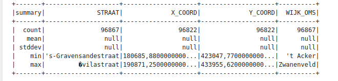
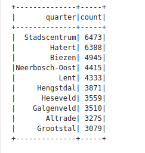
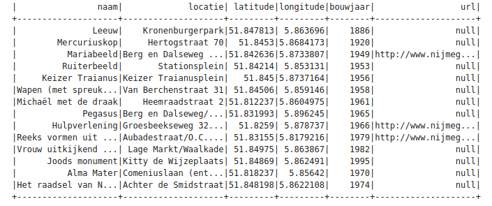
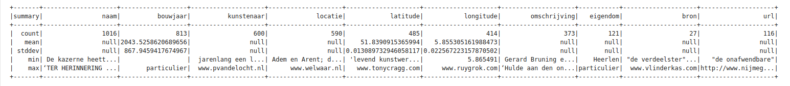
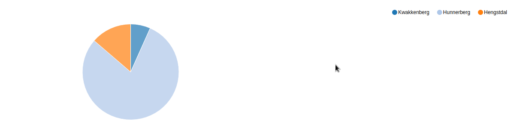
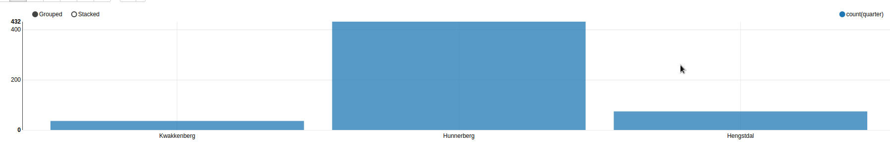
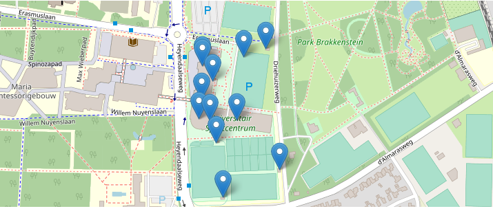
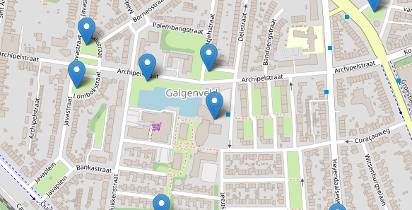

# Assignment 4
In this assignment we analyze data provided by the city of Nijmegen by integrating two data sets - one with streetnames and their quarters and one with public artworks.

## Data Cleaning
We begin by using the BAG-file, which contains records of addresses and buildings. 

To load this file we use

```
val bagdata = spark.read.format("csv").option("header", true).load("file:///opt/hadoop/share/data/BAG_ADRES.csv").cache()
```
The dataset has fields like "ACTCODE", "ADRES_ID", "X_COORD" , "Y_COORD" and 16 more fields.

Then we create a dataframe of only 4 fields of the dataset using

```
val addrDF = bagdata.select('STRAAT, 'X_COORD, 'Y_COORD, 'WIJK_OMS)
```

We use .show() to show the rows of the dataframe, .describe().show() is used for showing the statistics of the value distributions. These are the statistics:


In these statistics we can see that the mean for X and Y coordinates is null which probably means that not all of the data has an X and Y coordinate. 
We can see how many X and Y coordinates by using 
```
addrDF.filter( $"X_COORD".isNull ).count
addrDF.filter( $"Y_COORD".isNull ).count
```
From this we find that there are 45 X_COORD and 45 Y_COORD missing. Since these records constitute a very small fraction of the total rcords (45 out of 100k), we can make the decision to leave these out.

###  Can we proceed without these records? Can you write the small numbers of lines of code to inspect these records?

To see the value of the STATUS field in the  records with the missing values we use
```
bagdata.filter($"X_COORD".isNull).show(45)
```
which shows that the status is "Niet authentiek".

With
```
bagdata.groupBy($"STATUS").count
```
we can see that this particular status only occurs in less than 1% of the data and with 
```
addrDF.filter($"X_COORD".isNull).show(45) 
```
we can see that this data contains addresses from different streets and quarters which seem to be random and do not have some clear connection to each other.

So in this particular instance we can delete these records as it should not have any significant impact on the results.

To provide a more structured interface to the data we define a case class with street and quarter as strings and X and Y coordinates as float values to represent the data using
```
case class Addr(street:String, quarter:String, x:Float, y:Float)
```
Then we project this case class into a dataset.

However when we select the X and Y coordinates as floats we get null value for all instances. This is because the coordinates contain commas instead of dots.
So to fix this we use  a function that converts the data to floats using Dutch language settings (which uses commas):
```
import java.text.NumberFormat
import java.util.Locale
val nf = NumberFormat.getInstance(Locale.forLanguageTag("nl")); // Handle floats written as 0,05 instead of 0.05

def convToFloat(s: String): Option[Float] = {
  try {
    Some(nf.parse(s).floatValue)
  } catch {
    case e: Exception => None
  }
}
import java.text.NumberFormat
import java.util.Locale
```
### Did we use the dataset or the dataframe API in the cell:
```
printf(
  "%d points at origin, %d null values",
  addrDF.filter("x = 0 or y = 0").count,
  addrDF.filter('x.isNull or 'y.isNull).count
)

45 points at origin, 0 null values
```
We used the dataset because with this new function values with missing coordinates give ‘0’ for the coordinates instead of ‘Null’. 
And this has an impact on the standard deviation and other values such as min because records that actually have null as the value for the coordinates will now have 0, while the other records will have much higher values.

To calculate the number of addresses for each quarter we use:
```
val qc_1 = addrDF.groupBy("quarter").count.cache()
```
Then we can calculate the quarters with the most addresses using:
```
val qc_1_top = qc_1.orderBy(desc("count")).limit(10)
```
The result for this is:


## SQL

Using SQL makes working on larger and more complicated queries easier.

We can register the DataFrame as SQL temporary view by using:
```
addrDF.createOrReplaceTempView("addresses")
```
In SQL to determine the largest quarters we use:
```
val qc_2_top = spark.sql("SELECT quarter, count(quarter) AS qc FROM addresses GROUP BY quarter ORDER BY qc DESC LIMIT 10")
```
By looking at the query plans of SQL and DataFrame operators, I could see that in the optimized logical plan, there were lesser steps taken in SQL. And in the physical plan, the order of the steps were different but they looked similar.

## Artworks

To use art data we load the file “kunstopstraat-kunstwerk.csv”using:
```
val kunst = spark.read
    .format("csv")
    .option("header", "true") // Use first line of all files as header
    .option("inferSchema", "true") // Automatically infer data types
    .load("file:///opt/hadoop/share/data/kunstopstraat-kunstwerk.csv").cache()
```
This file contains the fields: naam, bouwjaar, kunstenaar, locatie, latitude, longitude, omschrijving, eigendom, bron en url.

To get a sample of the data we use:
``` 
kunstwerken.sample(true,0.1).show()
```
The result of which is


When we analyze the sample of the data we can see that all records have a name, but a lot of the other fiels are filled in incorrectly or ‘null’.
When the ‘bouwjaar’ is not a number then the other fields of that record are often ‘null’. 
We can  also see that the latitude and longitude are different from the coordinates of the bagdata.
From the records with bouwjaar below 2000 only one doesn’t have a location. This record can be found using:
```
spark.sql("SELECT * FROM kunstxy WHERE locatie IS NULL").show().
```

## Can you explain the various data problems we have encountered when working on this dataset? 

When we look at the art data using describe().


- We can see that in the count row all fields have a different count which means that a lot of data is missing.
- The mean ‘bouwjaar’ which means the 'construction year' is 2044, this would mean that some of the artworks are from the future.
We analyze the data further using sql queries
- With this we can also see some problems with the ‘latitude’ and ‘longitude’. Like they are  not always numbers and  when one of them is ‘null’ the other is usually text or an url.
Using the query
```
spark.sql("select * from kunst where bouwjaar > 2020").show(10)
```
- We get 5 records that have ‘9999’ as ‘bouwjaar', which does not make sense.
- We also know from earlier that when ‘bouwjaar’ is ‘null’ all the other fields also give ‘null’.

The missing data can cause some problems such as:

- There are 200 records (so almost 20%) that only have a name and have ‘null’ for all other fields. These can have an impact on the results of the data analysis as these values will not be included in the analysis. This impact can also cause us to miss some significant observation especially if the records with missing values are not random.
For example if there are some records from a certain location or year have alot of missing data, it would cause us to conclude that there is no art work from that location . However this is actually not the case. This is a fundamental problem and the only way to solve it is to find the missing values and enter them in the data.
- Fields like ‘bouwjaar’, ‘latitude’ and ‘longitude’ often have values that contain text instead of numbers. When an analysis is done using any of these fields we need to convert the values to integers or floats, which would give errors with text. We need to fix these issues by replacing these text values with the equivalent float or integer values.
 
So to make our analysis easier and more accurate for the future we clean the dataset by using
```
val ks = spark.sql("select * from kunst where (latitude is not null and longitude is not null) and bouwjaar '<' 9999").
              .write.parquet("file:///opt/hadoop/share/data/kos.parquet")
```

## Joining the datasets

To further analyze the data and draw more conclusions, we join the artwork and addresses datasets.
We will join them using the coordinates, but this has some issues as the BAG data uses the 'national triangle coordinates' while the artworks data uses (lat, lon) coordinates. We solve this problem using the Java library(Coordinate Transformation Suite) that can convert these coordinates.

To join the datasets by selecting the name and year from the artworks and the quarter from addresses for records that have coordinates close to each other and save this as kosquarter. This is done by using:
```
create temp view kosquarter as
select distinct naam, quarter, first(latitude), first(longitude), min(bouwjaar) as jaar from kosxy, addr
where abs(kosxy.x - addr.x) < 10.0 and abs(kosxy.y - addr.y) < 10.0
group by naam, quarter
```
We can analyze the data as graphs. Below is a pie chart adn bar graph representation of the quarters close to the street 'Berg en Dalseweg'.




We can also plot the data on a map. TO plot the map of the street 'Heyendaalseweg' we use
```
select street, quarter, latlon._1 as lat, latlon._2 as lon
from ( select street, quarter, txyudf(x,y) as latlon from addr where street = "Heyendaalseweg")
```


Now we can use these joint datasets to analyze and get more information about Nijmegen.
We can find out the growth of Nijmegen through the years from the years in which the artworks were created using 
```
spark.sql("select distinct quarter, min(jaar) as jaar from kosquarter group by quarter order by jaar").show(100,false)
```
The results for this is:
- Stadscentrum		1554
- Benedenstad		1618 
- Bottendaal		1900 
- Altrade		1904 
- Hazenkamp		1909

We can see that the in the first years there is mostly art near or in the city centre. But with more time more quarters with art existed.

On further analysis we can see that some quarters of Nijmegen are not in this list. Using
```
spark.sql(“select distinct quarter from addresses where quarter not in (select quarter from kosquarter)”)
```
we can find the 28 quarters that currently are not in kosquarter. Then we can use 
```
spark.sql("select naam from kos where naam not in (select naam from kosquarter)")
```
count shows that there are 136 artworks not assigned.

With the following code we can plot the artworks without quarters on a map
```
select *  from kos where naam not in (select naam from kosquarter)
```
The map looks as follows:



We can assign more artworks to locations by increasing the range for matching coordinates. However we have to be carfult as a higher value can decrease accuracy because artworks that are close to a border between quarters can be assigned to multiple quarters. To solve this we can assign artworks to the closest address.


