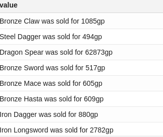
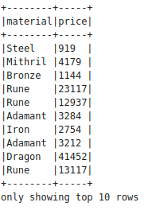
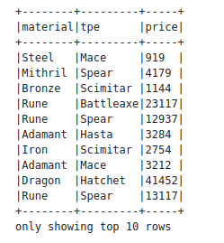

# Assignment5

In this assignment we are using Spark Structured Streaming to analyze the data from an online marketplace that sells RuneScape game items.

We are using HDFS for this assignment and to get rid of any errors that may occur we run 
```
%sh
sed -i -e 's|hdfs://localhost:9000|file:///tmp|' /opt/hadoop/etc/hadoop/core-site.xml
```

We start a simulation that generates a stream of events inside the docker container. The RuneScape like output is written to port 9999 by the simulator which is a python program. To do this we need to copy the program to the container and then execute it when we start the container.

Then we do a few imports so that we can work with the streams. Then we create dataframe and tie it to the TCP/IP stream n localhost port 9999 using
```
val socketDF = spark.readStream
  .format("socket")
  .option("host", "0.0.0.0")
  .option("port", 9999)
  .load()
```

Now we can start the data processing. I encountered alot of errors when I tried this but restarting the containers and deleting then importing the notebook again resolved these. Our goal at this point is to write data to the in-memory dataframe from the TCP/IP connection that we are listening on port 9999. We read all data that comes from the socket. I first tried this with a window of 1 second but that did not show any data. When I tried with a 5 second window I got 3 rows of data so then I ran it for 10 seconds adn got a good amount of data. Since there is alot of data and can cause the docker container memory to fill up we stop it.
```
val memoryQuery = streamWriterMem  
  .queryName("memoryDF")
  .start()

// Run for 1 second...
memoryQuery
  .awaitTermination(10000)
  
// ... and stop the query, to avoid filling up memory:
memoryQuery
  .stop()
```

memoryQuery is StreamingQuery that splits data into separate lines based on newline. To read this saved output and analyze it we use sql
```
select * from memoryDF LIMIT 10
```
The output of which is the first ten rows of the data 


To count how many rows we got from the stream we use
```
spark.sql("select count(*) from memoryDF").show()
```
The output of which is 860 rows. 

## Parsing the data

Until now we only  read the data line by line without any structure. Once we figure out the structure we can create objects out of this data. To do so, we transform the data from String to a structure using a regular expression on the data from the stream before it is written to memory. I used:
```
val myregex = "\"^([A-Z].+) [A-Z].+ was sold for (\\\\d+)\""
val q = f"select regexp_extract(value, $myregex%s, 1) as material, cast(regexp_extract(value, $myregex%s, 2) as Integer) as price from memoryDF"
spark.sql(q).as[RuneData].show(10, false)
```
The output of which is:


## Stream Processing

Until now we were reading the data and then processing it. But it would be more efficient and practical to process and read the data simultaneously using continous stream processing.
```
val consoleQuery = socketDF
  .writeStream
  .outputMode("append")
  .format("console")
  .start()
```
The above command continuously runs the  stream and instead of saving it to memory it writes it to the console in groups of 10 lines until it is stopped.

## Structured Console output

Now we structure the console output by using the same code as above. To do this we use class
```
RuneData with the attributes (material: String, tpe: String, price: Integer)
```
where tpe is the type.

The output of using the same regular expression here is:


## Saving the stream data


