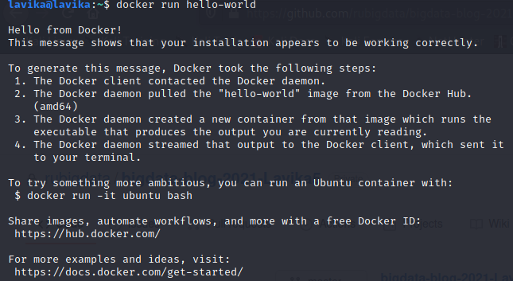
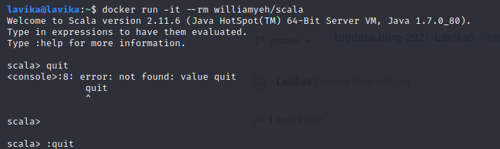
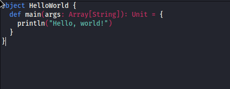
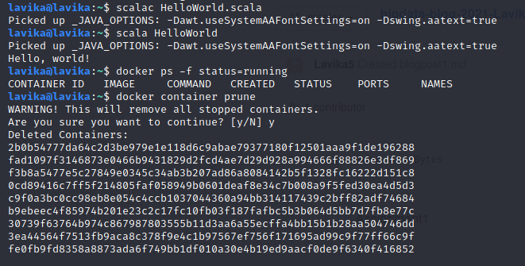

Information about my computer setup:
- processor: Intel i7.8565U
- RAM: 16 GB
- Operating System: Windows 64 bit

But for this assignment I used Debian (64 bit)

I installed docker using the guidelines given and then ran hello world:
- 

Then I installed scala and ran the docker run -it --rm williamyeh/scala:
- 

Then I installed nano and ran nano HelloWorld.scala and wrote the following code:
- 

Then I compiled the file and ran it:
- 

Then I removed the inactive containers.
